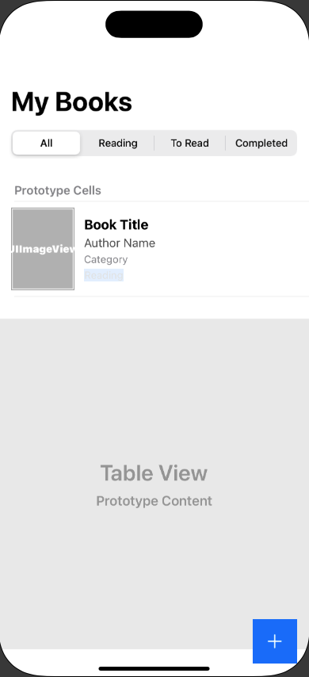

# FavBook - iOS Book Tracking App (In Progress)

FavBook is an iOS application that helps users manage their reading list. Users can search for books using the Google Books API, add them to their library, and track their reading progress.

## Features

- Search books using Google Books API
- Add books to your library
- Track reading status (To Read, Reading, Completed)
- View book details including title, author, and category
- Filter books by reading status
- Search within your library

## Screenshots



## Requirements

- iOS 16.0+
- Xcode 14.0+
- CocoaPods

## Dependencies

- Alamofire (~> 5.8.1) - For network requests
- SDWebImage (~> 5.18.0) - For image loading and caching

## Installation

1. Clone the repository
2. Install CocoaPods if you haven't already:
```bash
sudo gem install cocoapods
```
3. Install the dependencies:
```bash
pod install
```
4. Open `FavBook.xcworkspace` in Xcode
5. Build and run the project

## Usage

1. Launch the app
2. Tap the "+" button to search for books
3. Enter a book title, author, or ISBN in the search bar
4. Select a book from the search results
5. Confirm adding the book to your library
6. Use the segment control to filter books by reading status
7. Use the search bar to search within your library

## Architecture

The app follows the MVVM (Model-View-ViewModel) architecture pattern and uses Core Data for local storage.

## License

This project is licensed under the MIT License - see the LICENSE file for details 